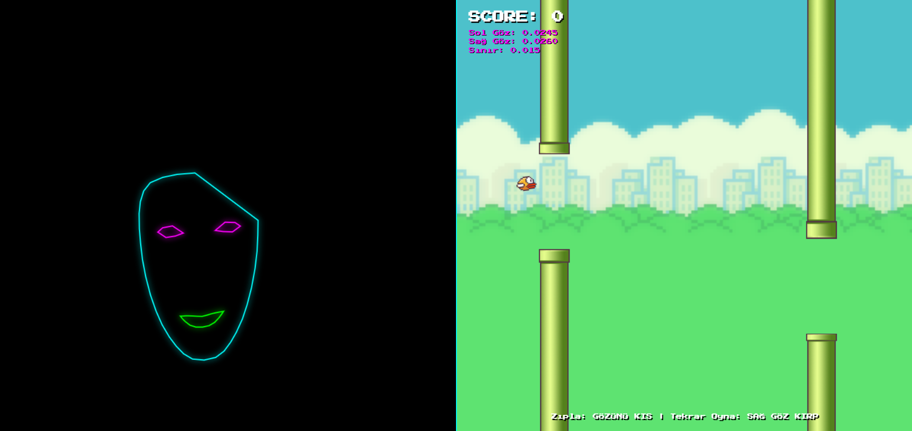

# Flappy Blink: Retro Edition 🕹️👁️

> Eller serbest! Sadece gözlerinizi kullanarak oynayabileceğiniz, yapay zeka destekli nostaljik bir Flappy Bird klonu.

 

## 🚀 Proje Hakkında
Bu proje, standart web kameraları üzerinden gerçek zamanlı yüz takibi (face tracking) yaparak fiziksel bir donanıma (klavye, mouse) ihtiyaç duymadan oyun oynama fikrinden doğdu. Klasik Flappy Bird mekaniklerini, Google'ın **MediaPipe Face Mesh** teknolojisiyle birleştirerek tamamen erişilebilir ve eğlenceli bir deneyim yarattım.

Başlangıçta tüm yüz hatlarını neon çizgilerle çizen siberpunk bir kontrol sistemi olarak tasarladığım projeyi, retro oyun grafikleriyle harmanlayarak "Flappy Blink" haline getirdim.

## ✨ Özellikler
* **Göz Kırpma ile Zıplama:** Kamera yüzünüzü algılar; herhangi bir gözünüzü kıstığınızda veya kırptığınızda kuş zıplar (yerçekimi ve sıçrama fiziği entegre edilmiştir).
* **Asimetrik Göz Kontrolü:** "Game Over" ekranında yeniden başlamak için klavyeye uzanmanıza gerek yok. Sadece **sağ gözünüzü kırparak** (sol göz açıkken) oyunu resetleyebilirsiniz.
* **Canlı Yüz Geri Bildirimi:** Ekranın sol tarafında, yüz hatlarınızı ve komut anını gösteren neon bir "Cyberpunk Face Mesh" aynası bulunur. Zıplama komutu algılandığında gözler beyaz parlayarak görsel geri bildirim verir.
* **Retro Grafikler ve Dinamik Zorluk:** Orijinal Flappy Bird varlıkları, piksel fontlar ve skor arttıkça hızlanan dinamik oyun yapısı.

## 🛠️ Kullanılan Teknolojiler
* **HTML5 Canvas:** Oyun motoru, fizik hesaplamaları ve retro grafik çizimleri için.
* **Vanilla JavaScript:** Oyun döngüsü (Game Loop) ve durum yönetimi.
* **MediaPipe Face Mesh:** Saniyede 30+ kare hızında 468 farklı yüz referans noktasını (landmark) milimetrik olarak tespit etmek için.

## 🧠 Nasıl Çalışıyor? (Core Logic)
Projenin kalbinde, üst ve alt göz kapakları arasındaki mesafeyi ölçen matematiksel bir algoritma yatıyor. MediaPipe'ın bize sunduğu koordinatları (üst kapak: 159, alt kapak: 145) alıp bir eşik değeriyle (`EYE_THRESHOLD`) karşılaştırıyorum.

```javascript
// Göz kapakları arasındaki mesafeyi ölç (Sol Göz)
let upperLid = p[159].y;
let lowerLid = p[145].y;
let distLeft = lowerLid - upperLid;

// Sağ Göz için de aynı işlem...
let distRight = p[374].y - p[386].y;

// Eğer göz mesafesi eşik değerinden küçükse (göz kısıldıysa)
if (distLeft < EYE_THRESHOLD || distRight < EYE_THRESHOLD) {
    let now = Date.now();
    // Art arda zıplamayı önlemek için debounce kontrolü (200ms)
    if (now - lastJumpTime > 200) {
        player.velocity = player.jumpStrength; // Kuşa yukarı yönlü kuvvet uygula
        lastJumpTime = now;
    }
}
